# AnClaw

一键安装、开箱即用的 AI 桌面助手。  
安装后不用写命令、不用改配置，打开就能聊、就能用、就能开始干活。

## AI 现在就能帮你工作

AnClaw 基于 OpenClaw 能力增强，重点解决了原生聊天体验生硬的问题，提供更自然、更顺手的聊天工作流。

- 类似豆包的聊天体验：对话更顺滑、信息层次更清晰。
- 支持文档上传：可直接上传文档进行问答、整理和改写。
- 本地优先：核心能力运行在本机，数据更可控。
- 一键上手：安装完成即可运行，默认无需额外配置。

## 下载地址（Windows EXE）

- GitHub Releases（推荐）：`https://github.com/<your-org>/<your-repo>/releases/latest`
- Gitee Releases（国内推荐）：`https://gitee.com/<your-org>/<your-repo>/releases`
- 当前仓库产物目录：`./win32-x64/`

> 发布时请把 `<your-org>/<your-repo>` 替换成你的实际仓库地址。

## 3 步开始使用（零配置版）

### 1) 下载并安装

下载 `.exe` 安装包，双击安装即可。

### 2) 启动 AnClaw

首次启动后会自动初始化运行环境。  
默认情况下无需手动配置，直接可进入主界面。

### 3) 直接开始聊天

进入聊天页面后，你可以：

- 直接输入任务，让 AI 执行
- 上传文档，让 AI 基于文档进行分析与生成
- 使用更自然的多轮对话持续推进任务

## 为什么比原生 OpenClaw 更好用

### 更自然的聊天交互
针对原生界面的“生硬感”做了体验优化，整体交互更接近常用 AI 对话产品，学习成本更低。

### 文档上传即用
支持在聊天场景中上传文档，快速完成摘要、问答、整理、改写等高频任务。

### 本地运行更安心
应用与网关统一在本机管理，适合长期使用和持续迭代。

## 使用手册（安装后）

### 首页
- 查看当前运行状态
- 进入聊天入口

### 聊天
- 选择 AnClaw 聊天页面（推荐）
- 上传文档并发起问题
- 通过多轮对话持续补充需求

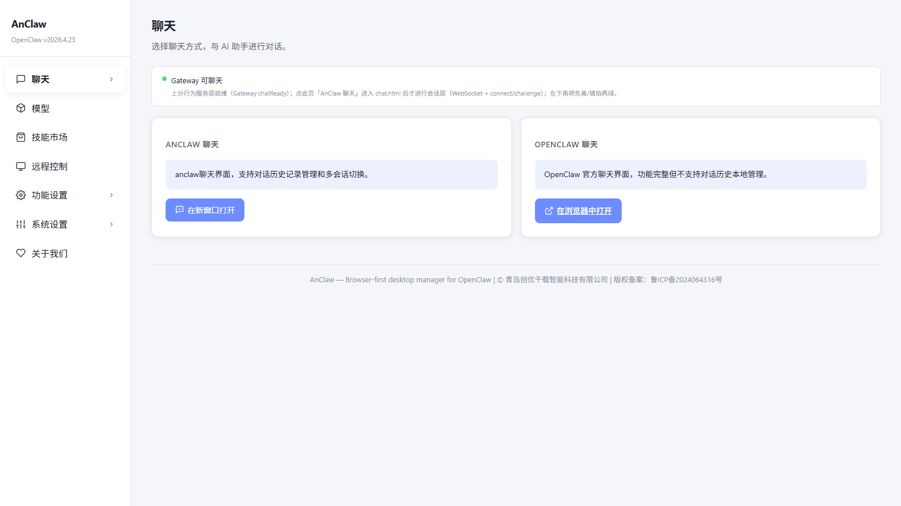
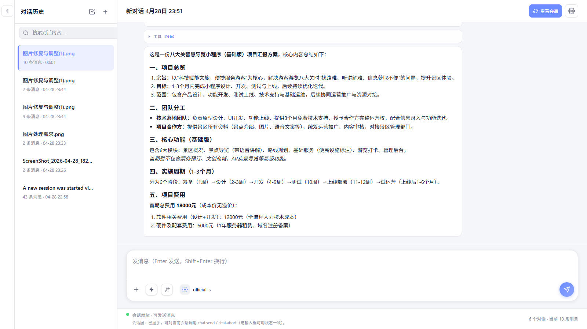
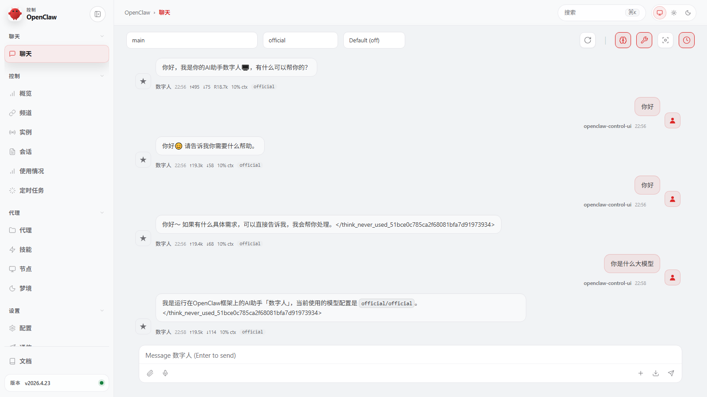

### Remote
- 可按需接入远程通道（如飞书）
- 配置后可在外部聊天工具中调用 AnClaw

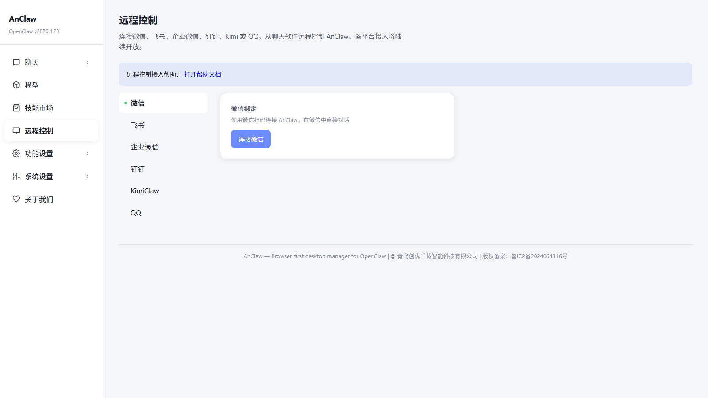
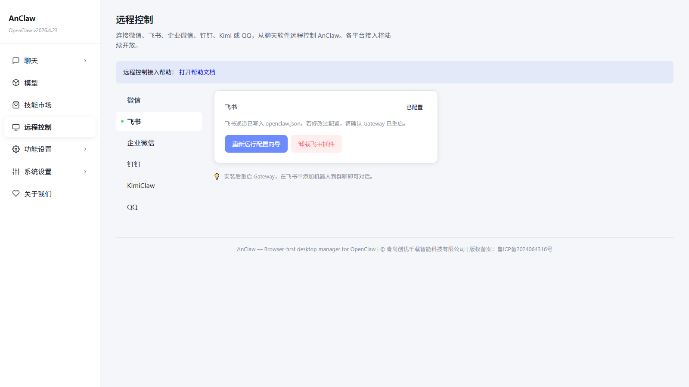

### 更新
- 在更新页检查新版本并升级
- 建议保持最新版以获得最佳体验

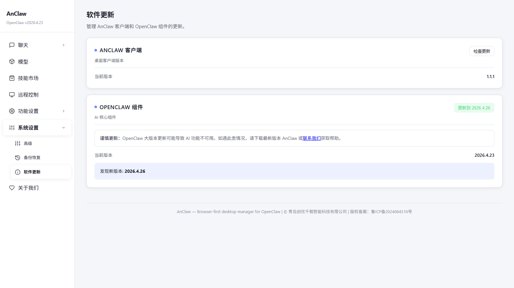

## 图文素材与截图

- 产品截图目录：`./images/`
- 自动截屏脚本说明：`../admin-backend/README.md`

### 其他页面预览

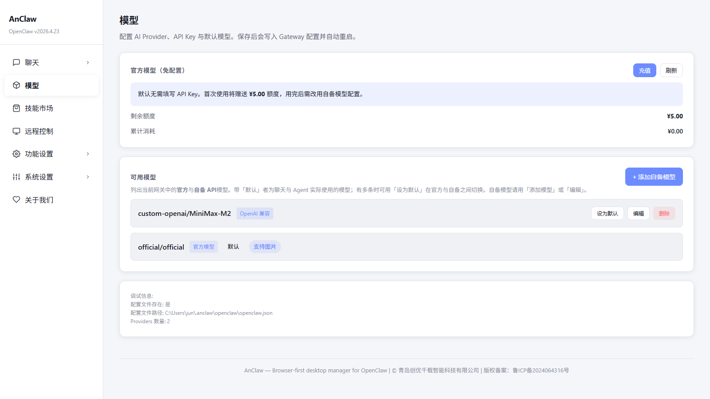
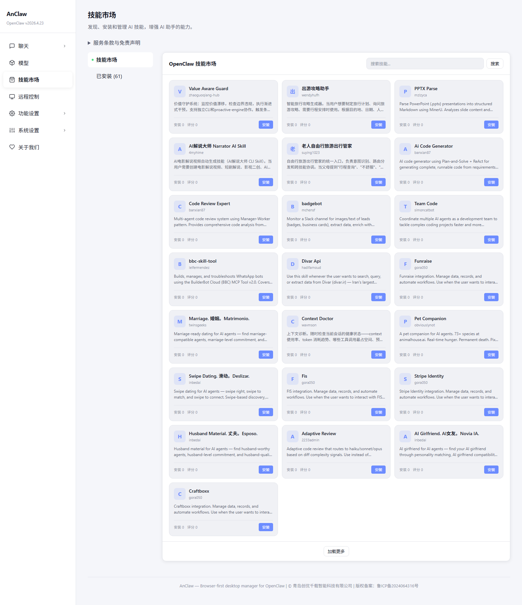
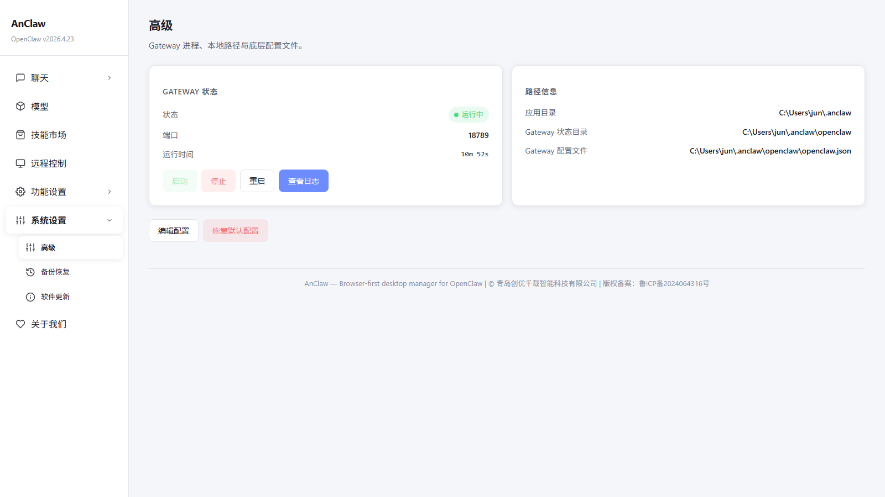
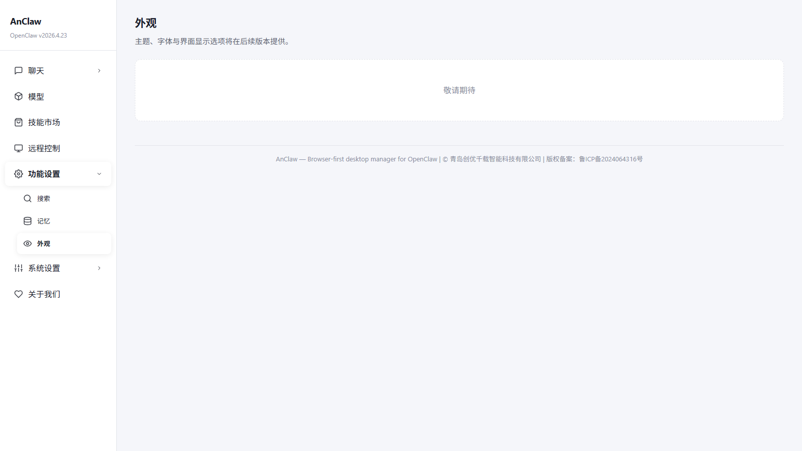
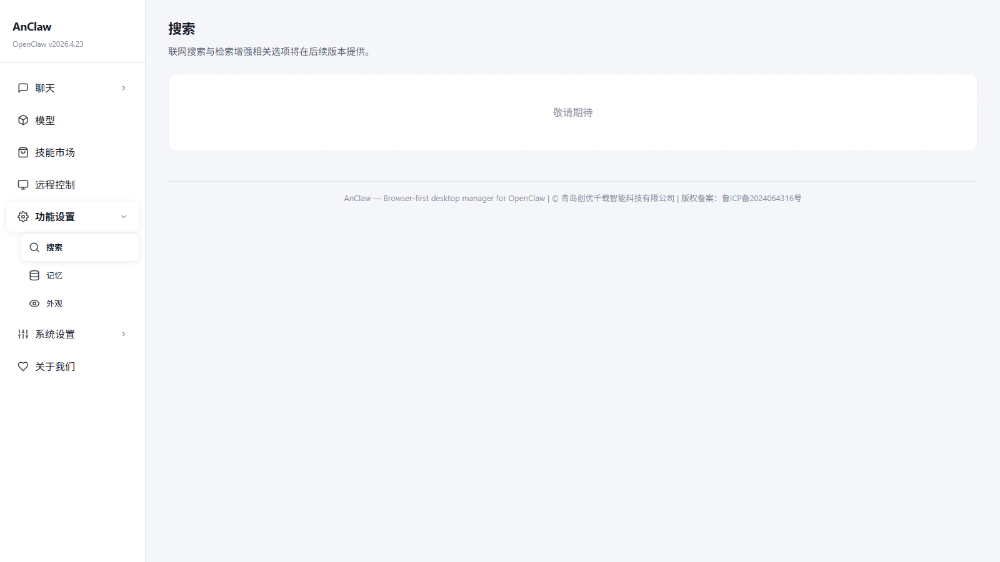

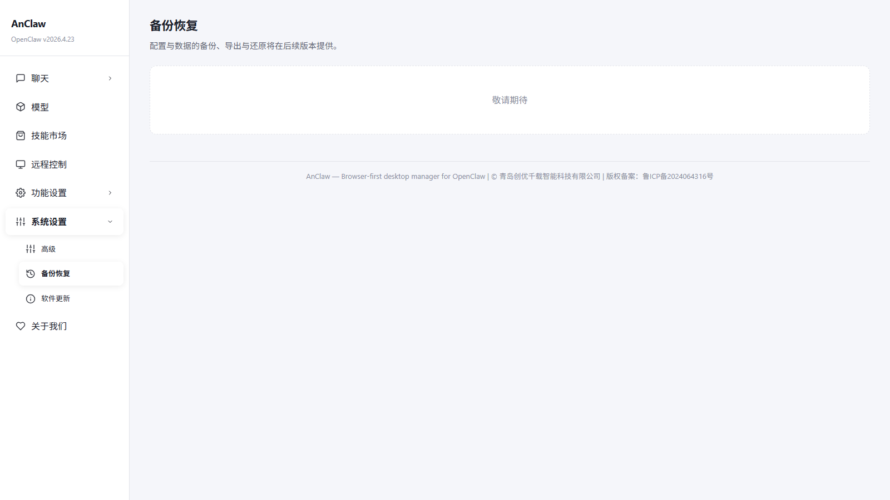
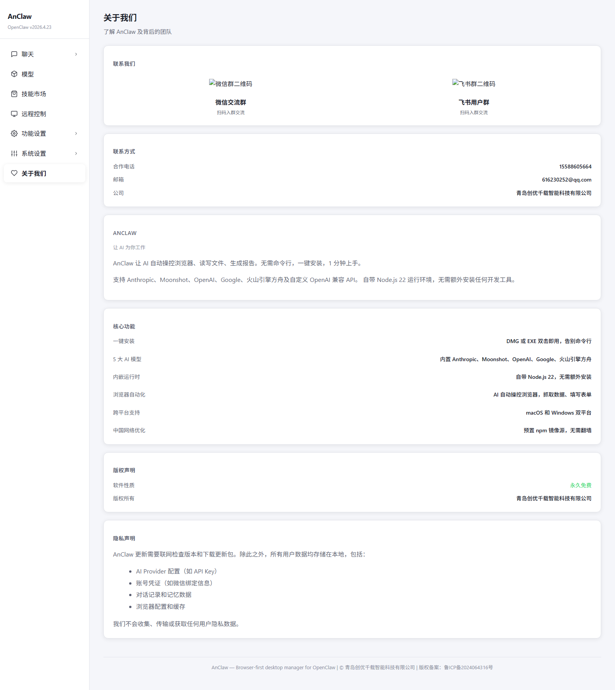
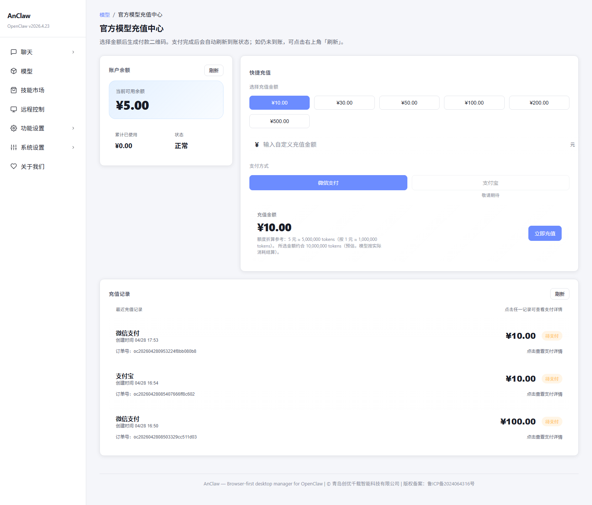

## 开源协作

欢迎提交 Issue / PR，一起把 AnClaw 做成真正好用的 AI 桌面助手。  
如果这个项目对你有帮助，欢迎在 Gitee 和 GitHub 点个 Star。

## License

请以仓库根目录 License 文件为准。
